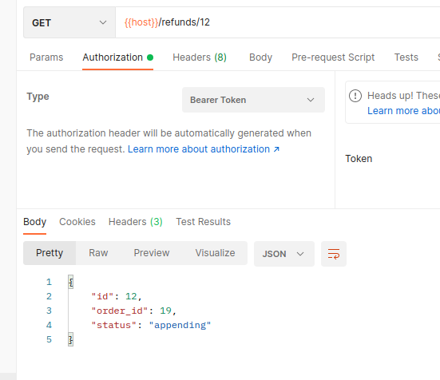

# RabbitMQ Order Processing with Go

<!--  -->

This project showcases an order processing system implemented using RabbitMQ as the message broker and the Go programming language. The system consists of a producer that sends orders to a RabbitMQ queue and a consumer that processes those orders and updates their status.

## Features

- **Order Submission**: The producer application sends example orders to the RabbitMQ queue, simulating incoming orders for processing.
- **Order Processing**: The consumer application listens to the RabbitMQ queue and processes orders as they arrive. It updates the order status and performs necessary actions based on the order content.
- **Real-time Communication**: RabbitMQ ensures efficient communication and coordination between the producer and consumer, allowing orders to be processed in near real-time.
- **Scalability**: The RabbitMQ architecture supports scalability, allowing you to add more consumers as needed to handle increased order volumes.
- **Asynchronous Processing**: Orders are processed asynchronously, reducing the likelihood of delays and bottlenecks in the system.
- **Fault Tolerance**: RabbitMQ provides features like message acknowledgments and durable queues, ensuring that messages are not lost even in the event of system failures.
- **Simple Setup**: The project includes a straightforward setup process, enabling you to quickly get started with RabbitMQ and Go.
- **Easy Customization**: You can easily modify the producer and consumer applications to suit your specific business requirements and integrate them into your existing systems.

## Requirements

- Docker Compose

or

- Go (1.13+ recommended)
- RabbitMQ (running locally or on a reachable server)
- MySQL (runnling locally or on a reachable server)

## Getting Started

1. Clone the repository:

```bash
git clone https://github.com/BaseMax/RabbitMQOrderGo.git
cd RabbitMQOrderGo
```

2. download rependencies:
```bash
go mod tidy
```

3. Copy example config and change it
```
cp .env.example .env
```

4. Start the project by docker:
```bash
docker-compose up -d
```

NOTE: producer and consumer was located on one application. One endpoint will produce and another will consume.

### Note for debugging

- You can vendor all dependencies before using docker build. This will speed up your build process.
```bash
go mod vendor
```

- You can just up MySQL and RabbitMQ server and then change temporary your app configuration for using this servers.
```bash
docker-compose down
docker-compose up db rabbit -d

RABBIT_HOSTNAME=localhost MYSQL_HOSTNAME=localhost go run .
```

- Check `localhost:1567` for RabbitMQ manager.

- Use `testutils.sh`.
1. Source it on your shell
```bash
. testutils.sh
```

2. Export TOKEN
```bash
TOKEN="token"
```

2. Use its functions to create mock data on database.
```bash
getToken
fakeOrders
completeOrders
calcelOrders
fakeRefunds
```

You can track RabbitMQ manager during calling functions.

## API

### Health Check

**Endpoint:** `/health`

**Method:** `GET`

**Description:** Health check endpoint to verify the server's status.

**Admin Only**

---

### Register

**Endpoint:** `/register`

**Method:** `POST`

**Description:** Register endpoint to save a new user.

---

### Login

**Endpoint:** `/login`

**Method:** `POST`

**Description:** Login endpoint to verify user authority and return JWT token.

---

### Refresh

**Endpoint:** `/refresh`

**Method:** `POST`

**Description:** Refresh endpoint for refreshing user token.

---

### Get All Users

**Endpoint:** `/users`

**Method:** `GET`

**Description:** Sumbit all users.

**Admin Only**

---

### Edit User

**Endpoint:** `/user/:id`

**Method:** `PUT`

**Description:** Update content of a user.

**Admin Only**

---

### Create Order

**Endpoint:** `/orders`

**Method:** `POST`

**Description:** Submit an order for processing.

---

### Fetch Order

**Endpoint:** `/orders/:id`

**Method:** `GET`

**Description:** Retrieve the status of a specific order.

---

### Fetch All Orders

**Endpoint:** `/orders`

**Method:** `GET`

**Description:** Retrieve the status of a specific order.

---

### Edit Order

**Endpoint:** `/orders/:id`

**Method:** `PUT`

**Description:** Update the status of a specific order.

---

### Order Status

**Endpoint:** `/orders/:id/status`

**Method:** `GET`

**Description:** Update the status of a specific order.

---

### Cancel Order

**Endpoint:** `/orders/:id/cancel`

**Method:** `POST`

**Description:** Update the status of a specific order.

---

### First Order

**Endpoint:** `/orders/fist`

**Method:** `GET`

**Description:** Browse first available order from queue.

**Admin Only**

---

### Complete Order

**Endpoint:** `/orders/first/done`

**Method:** `POST`

**Description:** Complete first available order from queue and dequeue it.

**Admin Only**

---

### Delete Order

**Endpoint:** `/orders/:id`

**Method:** `DELETE`

**Description:** Delete a specific order.

**Admin Only**

---

### Create Refund

**Endpoint:** `/refunds/:order_id`

**Method:** `POST`

**Description:** Request a refund for a specific order.

---

### Fetch Refund

**Endpoint:** `/refunds/:id`

**Method:** `GET`

**Description:** Retrieve a specific refund.

---

### Fetch All Refunds

**Endpoint:** `/refunds`

**Method:** `GET`

**Description:** Retrieve all refunds.

---

### Refund Status

**Endpoint:** `/refunds/:id/status`

**Method:** `GET`

**Description:** Check the status of a refund request for a specific order.

---

### Cancel Refund

**Endpoint:** `/refunds/:id/cancel`

**Method:** `POST`

**Description:** Cancel a refund.

---

### First Refund

**Endpoint:** `/refunds/first`

**Method:** `GET`

**Description:** Browse first available refund from queue.

**Admin Only**

---

### Complete Refund

**Endpoint:** `/refunds/first/done`

**Method:** `POST`

**Description:** Process first available refund from queue and dequeue it.

**Admin Only**

---

### Delete Refund

**Endpoint:** `/refunds/:id`

**Method:** `DELETE`

**Description:** Delete a specific refund.

**Admin Only**

---

| Method | Endpoints | Description | Screenshot |
| --- | --- | --- | --- |
| POST | /register | Register endpoint to save a new user. |  |
| POST | /login | Login endpoint to verify user authority and return JWT token. |  |
| POST | /refresh | Refresh endpoint for refreshing user token. |  |
| POST | /orders | Submit an order for processing. |  |
| GET | /orders/:id | Retrieve the status of a specific order. |  |
| GET | /orders | Retrieve the status of a specific order. |  |
| PUT | /orders/:id | Update the status of a specific order. |  |
| GET | /orders/:id/status | Get the status of a specific order. |  |
| POST | /orders/:id/cancel | Cancel specific order. |  |
| GET | /orders/fist | Browse first available order from queue. |  |
| POST | /orders/first/done | Complete first available order from queue and dequeue it. |  |
| DELETE | /orders/:id | Delete a specific order. |  |
| POST | /refunds/:order_id | Request a refund for a specific order. |  |
| GET | /refunds/:id | Retrieve a specific refund. |  |
| GET | /refunds | Retrieve all refunds. |  |
| GET | /refunds/:id/status | Check the status of a refund request for a specific order. |  |
| POST | /refunds/:id/cancel | Cancel a refund. |  |
| GET | /refunds/first | Browse first available refund from queue. |  |
| POST | /refunds/first/done | Process first available refund from queue and dequeue it. |  |
| DELETE | /refunds/:id | Delete a specific refund. |  |
| --- | --- | --- |

## Database models

```go
type User struct {
	ID       uint   `gorm:"primaryKey" json:"id"`
	Password string `gorm:"not null" json:"pass"`
	Username string `gorm:"unique;not null" json:"user"`
	Email    string `gorm:"unique;not null" json:"email"`
}

type Order struct {
	ID          uint   `gorm:"primaryKey" json:"id"`
	UserID      uint   `json:"user_id"`
	Status      string `gorm:"not null;default:processing" json:"status"`
	Description string `gorm:"not null" json:"description"`

	User User `json:"-"`
}

type Refund struct {
	ID      uint   `gorm:"primaryKey" json:"id"`
	OrderID uint   `gorm:"not null;unique" json:"order_id"`
	Status  string `gorm:"not null;default:appending" json:"status"`

	Order Order `json:"-"`
}
```

## Acknowledgements

This project is built using the `rabbitmq/amqp091-go` Go library for RabbitMQ communication. Special thanks to the library authors and the Go community for their contributions.

Feel free to customize and expand upon this project to meet your specific use case and business requirements. If you have any questions or suggestions, please open an issue or pull request in this repository.

Enjoy processing orders efficiently with RabbitMQ and Go!

Copyright 2023, Max Base
